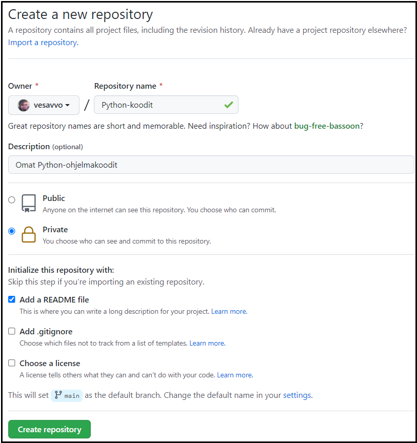

# Versionhallinnan käyttöönotto

Ohjelmistot rakentuvat vaihe vaiheelta ja pala palalta. Ohjelmistoja tehdään usein tiimityönä, ja tiimin jäsenten on päästävä käsiksi
samaan ohjelmakoodiin. Ohjelmakoodista syntyy kehitystyön aikana useita versioita, ja joskus on tarve palata aiempaan versioon. On myös
tärkeää varmistaa, että kerran kirjoitettu ohjelmakoodi ei vahingossa tuhoudu eikä katoa.

Tätä varten otetaan käyttöön versionhallinta.

## Git ja GitHub

Opintojaksolla (ja ammattimaisessa ohjelmistokehityksessä usein) käytetään Git-nimistä hajautettua versionhallintaa.
Hajautettu versionhallinta tarkoittaa sitä, että ohjelmakoodien yhteisestä tallennuspaikasta - eli repositoriosta - 
luodaan paikallisia kopioita versionhallinnan käyttäjien omille tietokoneille.
Ajantasaiset tiedot haetaan repositoriosta työskentelyn alkaessa (tästä käytetään termiä pull), ja tehdyt
muutokset päivitetään repositorioon (tätä kutsutaan termillä push).

GitHub on kaikkien saatavilla oleva verkkosivusto, johon Git-projektien ohjelmakoodit voidaan tallentaa.
Se on myös maailman suurin tähän tarkoitukseen kehitetty sivusto, ja käytännössä jokainen
ohjelmointialan ammattilainen käyttää tavalla tai toisella GitHubia.

Jotta voit käyttää GitHubia, rekisteröidy sen käyttäjäksi osoitteessa https://github.com/.

Kun olet luonut itsellesi käyttäjätilin GitHubiin, voit luoda sinne repositorioita eli tallennuspaikkoja
projekteille.

Voit luoda omille Python-koodeillesi repositorion kahdella tavalla: joko suoraan GitHubista tai PyCharm-kehittimen
kautta. Tarkastellaan ensin mainittua tapaa.

## Repositorion luominen GitHubissa

Aloitetaan luomalla oma GitHub-repositorio projektia varten:

1. Rekisteröidy GitHubin käyttäjäksi osoitteessa https://github.com/.
2. Kirjauduttuasi sisään paina **Repositories**-otsikon vieressä olevaa **New**-painiketta.
3. Tee itsellesi oma yksityinen repositorio alla olevan kuvan mukaisesti.

Tämän jälkeen PyCharm-kehittimelle annetaan pääsy GitHubiin ja täsmennetään käytettävä repositorio.

1. Valitse GitHub-tili, jota käytät. Paina **Ctrl/Alt S** tai **CMD/,**. Valitse **Version Control / Github /Add**, ja syötä
GitHub-kirjautumistietosi.

2. Ota repositorio käyttöön Python-projektissasi. valitse PyCharm-kehittimessä **VCS / Get from
Version Control**, ja hae GitHubissa luomasi Git-repositorio napsauttamalla **Clone**. PyCharm luo uuden 
projektin, joka käyttää GitHub-reposiota.

Jos GitHub-repositoriota ei ole ennalta olemassa, voit korvata toisen askeleen valitsemalla PyCharm-kehittimessä valinnalla
**VCS / create Git Repository**. Tällöin repositorio luodaan PyCharm-projektin pohjalta, ja voit valita,
mitä tiedostoja sinne tallenetaan.

Kun yhteys GitHub-repositorioon on muodostettu, ilmestyy PyCharm-kehittimen valikkoriville uusi Git-valikko.

## Repositorion käyttö

Tarkastellaan tässä vaiheessa GitHubin käyttöä yhden kehittäjän näkökulmasta. Tällöin voimme olettaa, että eri kehittäjät
eivät käytä samoja tiedostoja, ja tästä aiheutuvia samanaikaisen muokkauksen ongelmia ei esiinny. Oletamme myös, että
meille ei synny tarvetta jakaa kehitysprojektia eri kehityshaaroihin. GitHubin edistyneeseen
käyttöön kehitystiimin yhteistyöalustana
kannattaa perehtyä vasta myöhemmin projektityön alkaessa.

Työskentelyssä kannattaa ottaa tavaksi seuraavat käytännöt:
- Kun aloitat työskentelyn, anna komento **Git / Pull**. Komento hakee mahdolliset muuttuneet tiedot GitHub-palvelussa olevasta repositoriosta.
- Kun olet saanut uusia tuotoksia aikaan, sitouta muutokset komennon **Git / Commit** avulla. Muutosten pohjalta syntyy uusi
tallennuspiste, johon on mahdollista myöhemmin palata, jos tarvetta ilmenee. Sitouta muutokset aina viimeistään siinä vaiheessa, kun olet lopettamassa
työskentelyä.
- Kun lopetat työskentelyn, anna komento **Git / Push**. Komento kopioi paikallisella koneessa olevat sitoutetut muutokset GitHub-palvelussa
olevaan repositorioon.

Voit tutkia kehityshaaraa tallennuspisteineen GitHub-palvelussa.

Aina kun luot uuden tiedoston, PyCharm kysyy, otetaanko se mukaan versionhallintaan. Kaikki lähdekoodit, kuvat ja muut
arvokkaat tiedostot on syytä tallentaa GitHubiin. Toisaalta konfiguraatiotiedostot ja muu ajoympäristöön liittyvä
silppu kannattaa jättää versionhallinnan ulkopuolelle. Myöskään salasanoja sisältäviä tiedostoja ei tietoturvasyistä
tule tallentaa versionhallintaan.
