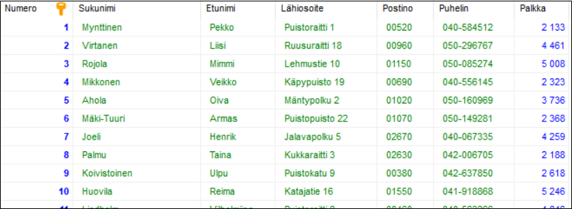
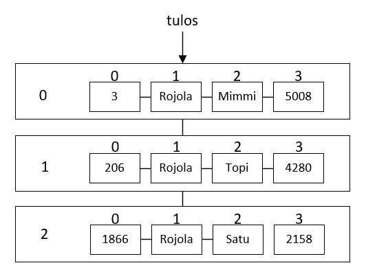

# Relaatiotietokannan käyttö

Tässä moduulissa opit käyttämään relaatiotietokantaa Python-ohjelmasta.

Sitä varten oletetetaan, että olet jo tutustunut relaatiotietokannan peruskäsitteisiin (taulukot, kentät,
tietueet, perus- ja viiteavaimet, tietotyypit), ja osaat ilmaista tietokantahakuja ja datan muutosoperaatioita
SQL-kielellä. Osaat myös suunnitella pienen tietokannan rakenteen ja perustaa tietokannan tietokantapalvelimelle.

Tässä moduulissa käytetään MariaDB-tietokantaa. Muita tiedonhallintaohjelmistoja käytettäessä prosessi on samankaltainen.

Ohjelmisto 1 -opintojaksolla olet perehtynyt relaatiotietokannan laadintaan ja käytön periaatteisiin opintojakson tietokantaosuudessa.
Siinä tutustuttiin myös MariaDB-tietokantaohjelmiston asentamiseen.

# Tietokanta-ajuri

Relaatiotietokannan käyttö itse ohjelmoidusta ohjelmasta edellyttää tietokanta-ajurin asentamista.

Tällä opintojaksolla ohjelmoimme Python-kielellä ja käytämme MariaDB-tiedonhallintaohjelmistoa. Tarvittava
tietokanta-ajuri on MariaDB:n ja oman Python-ohjelman välissä oleva ohjelma,
joka mahdollistaa ohjelmien välisen keskustelun.

Tietokanta-ajuria tarvitaan jo tietokantayhteyden muodostamiseen. Kun yhteys on muodostettu, ajurin ansiosta
ohjelmasta voidaan lähettää SQL-lauseita
(esimerkiksi `SELECT`-lauseita) tietokantapalvelimelle. Ajuri myös muuntaa kyselyn vastauksena saatavat tulosjoukot
Pythonin tietorakenteiden mukaisiksi.

Tietokanta-ajuri riippuu sekä tiedonhallintaohjelmistosta että valitusta ohjelmointikielestä. Nyt tarvitsemme siis
MariaDB-ohjelmistoa tukevan ajurin Python-kielelle. Koska MariaDB on yhteensopiva MySQL-tiedonhallintaohjelmiston kanssa, voimme 
asentaa MySQL-ajurin Python-kielelle.

Voit asentaa MySQL:n Python-ajurin jommallakummalla alla esitetyistä tavoista. Valitse asennustavoista vain toinen.
- Valitse PyCharmissa **View/Tools Windows/Python Packages**. Kirjoita hakukenttään
hakusanaksi **connector** ja etsi luettelosta vaihtoehto **mysql-connector-python**. Napsauta kyseistä vaihtoehtoa ja paina **Install**.
- Vaihtoehtoisesti voit asentaa ajurin verkkosivun https://dev.mysql.com/downloads/connector/python/ ohjeen mukaan.

Tässä materiaalissa oletetaan, että käytämme MySQL-ajuria käyttöönoton helppouden ja käytön ongelmattomuuden vuoksi
sekä MySQL-ajurin pitkän historian takia (ensimmäinen MariaDB-ajuri julkaistiin vasta vuonna 2020).
 Niinpä vaihtoehto 1 on tämän opintojakson näkökulmasta suositeltava. Jos haluat kuitenkin asentaa MariaDB:n Connector/Python-ajuri, voit tehdä sen verkkosivun https://mariadb.com/docs/clients/mariadb-connectors/connector-python/install/
ohjeen mukaan.

Kun olet asentanut MySQL:n tietokanta-ajurin, voit testata sen toiminnan kirjoittamalla yhdestä `import`-lauseesta koostuvan ohjelman:
```python
import mysql.connector
```

Huomaa, että jos käytät MariaDB-ajuria, kirjaston hakeva `import`-lause
poikkeaa materiaalissa esitetystä, ja ajurin toiminnassa voi olla vähäisiä eroja MySQL-ajurin toimintaan verrattuna.

Jos ajuri on asentunut oikein, mitään ei tapahdu. Jos asennuksessa on ollut ongelma, saat virheilmoituksen. Korjaa asennus
tarvittaessa.

Asennuksen yhteydessä saatat saada virheilmoituksen, jonka mukaan tietokoneesta puuttuu Microsoftin Visual C++ -kirjasto. Jos näin kävisi,
asenna puuttuva kirjasto Microsoftin sivuilta https://www.microsoft.com/en-us/download/default.aspx hyödyntäen sivuston hakutoimintoa.
Virheilmoitus kertoo yksityiskohdat hakua varten.


## Tietokantayhteyden muodostaminen

Tarkastellaan esimerkkitietokantaa nimeltä `ihmiset`. Tietokanta sisältää `Työntekijä`-nimisen taulukon,
jonka rakenne ja sisältö ilmenevät seuraavasta näytteestä:



Taulukon perusavaimena on `Numero`-kenttä. Esimerkin yksinkertaisuuden vuoksi tietokannassa on vain yksi taulukko.

Täydennämme ohjelmaa siten, että se ottaa tietokantayhteyden MariaDB-palvelimeen:

```python
import mysql.connector

yhteys = mysql.connector.connect(
         host='127.0.0.1',
         port= 3306,
         database='ihmiset',
         user='dbuser',
         password='sAL_a3ana',
         autocommit=True
         )
```

Yhteys muodostetaan tietokanta-ajurin `connect`-metodin avulla. Katsotaan metodin parametreja tarkemmin:
- `host` määrittää tietokoneen, johon yhteys otetaan. Kun yhteys otetaan samassa koneessa olevaan palvelimeen,
jossa Python-ohjelmaa ajetaan, kirjoitetaan osoitteeksi `127.0.0.1` tai vaihtoehtoisesti `localhost`.
- `port` määrittää tietoliikenneportin, jota tietokantapalvelin kuuntelee. MariaDB:n käyttämä portti on 3306, jos
et ole erikseen muuttanut sitä.
- `database` määrittää tietokannan nimen.
- `user` määrittää käyttäjätunnuksen, jolla tietokantaa käytetään. Python-sovellusta varten kannattaa luoda oma käyttäjätunnus,
jolla on tarvittavat oikeudet datan lukemiseen ja muokkaamiseen. Muita oikeuksia tuolle käyttäjätunnukselle ei yleensä tule antaa.
- `password` määrittää käyttäjätunnukseen liittyvän salasanan. Huomaa, että Internetin kautta käytettäviä Python-ohjelmia ajetaan
taustapalvelimella, jolloin loppukäyttäjällä ei ole pääsyä salasanan sisältävään Python-koodiin.
- `autocommit` kertoo, sitoutetaanko jokainen SQL-operaatio välittömästi omana transaktionaan. Tähän 
kannattaa normaalisti asettaa arvoksi `True`, jolloin yksittäisten päivityslauseiden (esim. `UPDATE`)
sitouttamisesta `COMMIT`-lausein ei tarvitse erikseen huolehtia.

Jos ohjelma ei vieläkään tulosta mitään näkyvää, kun ajat sen, asiat ovat hyvin: ajuri on asennettu ja tietokantaan
saadaan onnistuneesti yhteys.

## Hakukysely ja tulosjoukon käsittely

Kirjoitetaan nyt tietokantaa käyttävä ohjelma, joka kysyy käyttäjältä sukunimen,
hakee sitä vastaavien työntekijöiden tiedot tietokannasta ja esittelee kunkin työntekijän:

```python
import mysql.connector

def haeTyöntekijätSukunimellä(sukunimi):
    sql = "SELECT Numero, Sukunimi, Etunimi, Palkka FROM Työntekijä"
    sql += " WHERE Sukunimi='" + sukunimi + "'"
    print(sql)
    kursori = yhteys.cursor()
    kursori.execute(sql)
    tulos = kursori.fetchall()
    if kursori.rowcount >0 :
        for rivi in tulos:
            print(f"Päivää! Olen {rivi[2]} {rivi[1]}. Palkkani on {rivi[3]} euroa kuussa.")
    return

# Pääohjelma
yhteys = mysql.connector.connect(
         host='127.0.0.1',
         port= 3306,
         database='ihmiset',
         user='dbuser',
         password='sAL_a3ana',
         autocommit=True
         )

sukunimi = input("Anna sukunimi: ")
haeTyöntekijätSukunimellä(sukunimi)

```

Ohjelmaa ajettaessa saadaan seuraava tuloste:
```monospace
Anna sukunimi: Rojola
SELECT Numero, Sukunimi, Etunimi, Palkka FROM Työntekijä WHERE Sukunimi='Rojola'
Päivää! Olen Mimmi Rojola. Palkkani on 5008 euroa kuussa.
Päivää! Olen Topi Rojola. Palkkani on 4280 euroa kuussa.
Päivää! Olen Satu Rojola. Palkkani on 2158 euroa kuussa.
```

Tietokantahaku on ohjelmoitu `haeTyöntekijätSukunimellä`-funktion sisälle.

Aluksi kyselyn tuottava SQL-lause rakennetaan merkkijonomuuttujaan, jonka nimeksi ohjelmakoodissa on annettu `sql`.
Ohjelmaa kirjoitettaessa SQL-lauseen toimivuus kannattaa ensin testata tietokantaeditorissa (esimerkiksi HeidiSQL),
ja vasta kun kysely toimii, on aika upottaa se Python-ohjelmakoodiin. Tässä tapauksessa kyselyyn on "liimattava"
sukunimen arvo, joka saadaan parametrimuuttujasta.

Kun `sql`-muuttuja on rakennettu valmiiksi, se kannattaa tulostaa konsolille `print`-lauseella. Kysely menee
harvoin oikein ensi yrittämällä, ja virheenjäljitys on helpompaa, kun kysely tulostetaan nähtäville. Kun kysely on todettu
toimivaksi, voi tulostuslauseen poistaa tai lisätä rivin alkuun kommenttimerkin (`#`).

Kun kysely on valmis, pyydetään tietokantayhteysoliolta kursoriolio. Kursorin avulla SQL-lause voidaan välittää
tietokantapalvelimelle ja tarkastella tulosjoukkoa. Esimerkkikoodissa kursori pyydetään seuraavasti:

```python
kursori = yhteys.cursor()
```

Tämän jälkeen kursoria pyydetään suorittamaan merkkijonomuuttujassa oleva SQL-lause:

```python
kursori.execute(sql)
```

Sen jälkeen tulosjoukko on pyydetään palvelimelta:

```python
tulos = kursori.fetchall()
```

Metodikutsu hakee tulosjoukon kokonaisuudessaan. Jos tulosjoukko olisi erittäin suuri, olisi mahdollista hakea sen
tietueita pienissä määrin `fetchmany` ja `fetchone`-metodeilla. Tähän on harvoin tarvetta.

`Tulos`-muuttujaan tallennettu tulosjoukko on rakenteeltaan lista, jonka alkiot ovat monikoita. Ulomman rakenteen (listan) kukin
alkio vastaa yhtä tulosjoukon riviä. Jokainen rivi esitetään monikkona, ja sen alkioina ovat kenttien arvot
siinä järjestyksessä kuin ne `SELECT`-lauseessa määriteltiin.

Esimerkin tapauksessa tulosjoukkoa voi visualisoida seuraavasti:



Tulosjoukkoa voi tämän jälkeen käsitellä normaaliin listojen tapaan. Esimerkissä jokaista riviä vastaavasta
työntekijästä luodaan Työntekijä-olio. Luodut oliot kootaan `työntekijät`-nimiseen oliolistaan,
joka palautetaan metodin paluuarvona.

## Dataa muokkaava kysely

Dataa muokkaavien operaatioiden - eli `UPDATE`-, `INSERT`- ja `DELETE`-lauseiden - suorittaminen on suoraviivaisempaa
kuin hakukyselyiden suoritus. Tämä johtuu siitä, että tulosjoukkoa ei tarvitse käsitellä. Näiden operaatioiden
osalta tietokantapalvelin palauttaa ainoastaan tiedon siitä, moneenko tietueeseen tehty muutosoperaatio
on kohdistunut.

Tarkastellaan esimerkkinä työntekijän palkan muuttamista. Huomaa, että tässä esimerkissä päivitetään suoraan
tietokannassa olevan palkan arvoa. Yksittäiselle työntekijälle tehtävä muutos voitaisiin vaihtoehtoisesti
toteuttaa siten, että työntekijän tiedot haettaisiin tietokannasta, muutos tehtäisiin Python-kielen tasolla
olion ominaisuuteen ja lopuksi olion muuttunut tila päivitettäisiin tietokantaan. Alla olevassa esimerkissä
näin ei siis tehdä.

Kirjoitetaan tietokannassa olevan palkan päivittämiseksi toinen globaali funktio,
joka rakentaa ja suorittaa sitä vastaavan `UPDATE`-lauseen:

```python
def päivitäPalkkaa(numero, uusiPalkka):
    sql = "UPDATE Työntekijä SET Palkka=" + str(uusiPalkka) + " WHERE Numero=" + str(numero)
    print(sql)
    kursori = yhteys.cursor()
    kursori.execute(sql)
    if kursori.rowcount==1:
        print("Palkka päivitetty")
```

Lisätään pääohjelman loppuun syötteen luku- ja funktion kutsulauseet:
```python
numero = int(input("Anna numero: "))
uusiPalkka = float(input("Anna uusi palkka: "))
päivitäPalkkaa(numero, uusiPalkka)
```

Juuri kirjoitettu funktio vahvistaa tietokantaan tehdyn muutoksen:
```monospace
Anna numero: 2
Anna uusi palkka: 3456
UPDATE Työntekijä SET Palkka=3456.0 WHERE Numero=2
Palkka päivitetty
```

Onnistuneen päivityksen voi varmistaa tietokantaeditorin avulla suoraan tietokannasta.

