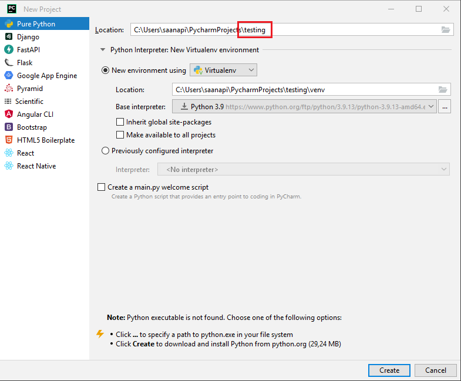
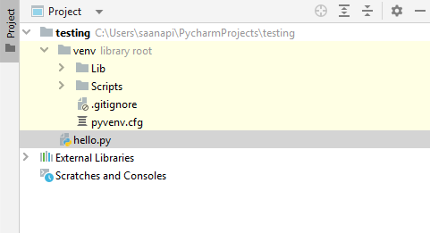

# First program

Welcome to study the Python programming language in Metropolia University of Applied Sciences!

... and the same in Python:
```
print("Welcome! Let's start learning Python programming!")
```

Python is one of the most popular programming languages in the world. When studying Python, you can:
- learn to program in a fun and easy way
- program with high-quality, user-friendly development tools
- create impressive graphics with visualization libraries
- apply artificial intelligence into your programs with extensive machine learning libraries

On your first year in Metropolia, you will acquire strong basic skills in Python programming. In future studies you will
deepen your knowledge in the Python language and learn to use Python efficiently in software development projects.

In this first module, you will install the Python development tools and learn to write and run your first Python program.

## Installation

Let's start by installing the development environment (IDE), which is short for *Integrated Development Environment*.
IDEs are professional software tools used for writing, executing, and testing program code.

On this course we are using the JetBrains PyCharm IDE. Please follow these instructions to install PyCharm:
1. Navigate to https://www.jetbrains.com/
2. Select **Developer tools / PyCharm** ja click **Download**.
3. Select the Professional version to download.
4. Register your user account using your Metropolia email to acquire a software license to use PyCharm. The installation tool will assist you with the registration.

Once your installation is finished, you can open PyCharm by clicking at the PyCharm icon on your computer.

## Creating a new project and a Python source file

Before you can start writing programs, you must create a new project. A project is a bit like a suitcase where you can store
programs focused on the same topic. For example, you can create a new project called 'Learning Python' for your first Python programs.
The name of the project is written at the end of the file path.



By default, a new project is created under a virtual environment (venv). Virtual environments help the management and version control of software packages required by programs.

When you select **Create**, the IDE prompts you whether you want to open the new project in a new window. You can select either option.

A project tree opens on the left side of the screen, showing you all the files that belong to the project.



Each program is written in a file under the project's directory. For the first program, you can create a new file by right-clicking the project name under the project tree.
Then select **New / Python file** and write the name for the new file in the popup window. You can name the first file `hello`. A new file with the name `hello.py` is now
seen is the project tree. File extension `.py` is characteristic of Python program files.

## Writing, saving and running a program

A program, or Python source code, is written in the editor field:


You can execute, or run, a program by right-clicking the editor field and selecting **Run 'hello'**.

Output will be shown in the console window at the bottom of the screen.

```python
Hello, world!
```

If there are errors in your program, don't worry! You will get an error message that helps you find the source for the error.
You can edit the program as many times as you need and run it over and over again.

Making errors is part of programming. It has been estimated that 80% of the work time of a professional programmer is used
for troubleshooting and fixing errors. Making errors also helps you learn. Every time you run into an error, find it, and fix it,
you have become a bit better at programming.
